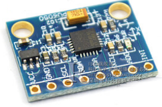

# MPU6050
InvenSense MPU-6050 accelerometer and gyro Sensor driver for TiJOS

| 条目         | 说明                            |
| ---------- | ----------------------------- |
| 驱动名称       | MPU6050 三轴加速度 陀螺仪             |
| 适用         | 该驱动适用于MPU6050 三轴加速度陀螺仪        |
| 通讯方式       | I2C                           |
| Java Class | TiMPU6050.java                |
| 图片         |  |
